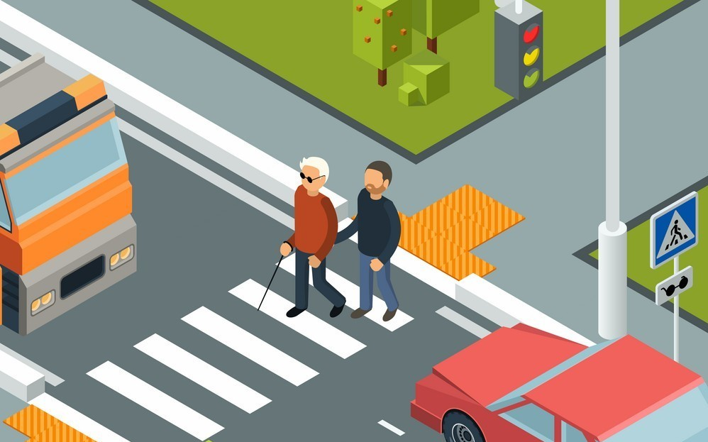

# **Road Crossing Assistant**

## 💡 Introduction

This is a  project with an aim to aid blind people for crossing road, more precisely, Indian roads where there may not be many traffic signals, and where traffic rules and speed limits may not be followed strictly.

We propose a ML/DL based model to **predict safe duration** for crossing road in a given video.

This repository includes Python implementation for various approaches we develop for the prediction model.

&nbsp;

## 🗃 Dataset

Our dataset contains 76 videos from diverse locations, time, traffic patterns, collected using an action camera from different roads of Anand, Gujarat.

[Dataset Usage and Download Link ](https://forms.gle/xtkZexnEuRVYfwAT6)

&nbsp;

## 💻 Technologies

- > **Languages** - Python
- > **Tools** - VSCode, Anaconda, Jupyter Notebook
- > **Libraries** - Pandas, NumPy, ImageAI, OpenCV

&nbsp;

## 🔨 **Implementation**

### [**Approach 1.1** ](https://nbviewer.jupyter.org/github/roadcross-assistant/Project/blob/master/Approach_1.1_individual_frames.ipynb)

It is our simplest approach where we extracted features from individual frames of the video and trained classification model to predict if a particular frame is safe/unsafe for crossing road.

### [**Approach 1.2** ](https://nbviewer.jupyter.org/github/roadcross-assistant/Project/blob/master/Approach_1.2_individual_frames.ipynb)

It is an advancement over Approach 1.1 where we have made an attempt to improve our feature extraction logic using direction detection.

### [**Approach 1.3** ](https://nbviewer.jupyter.org/github/roadcross-assistant/Project/blob/master/Approach_1.3_individual_frames.ipynb)

It is an advancement over Approach 1.2 where we have made an attempt to improve our features by adding relative speed of vehicles as features, and manually labelling the videos frame-wise instead of second-wise.

### [**Approach 2.1** ](https://nbviewer.jupyter.org/github/roadcross-assistant/Project/blob/master/Approach_2.1_multiple_frames.ipynb)

As it is obvious that even we as humans do not decide whether it is safe to cross a road by just having one glance at the road, we have started using multi-frame features instead of individual-frame features in this approach.

### [**Approach 2.2** ](https://nbviewer.jupyter.org/github/roadcross-assistant/Project/blob/master/Approach_2.2_multiple_frames.ipynb)

Approach 2.2 is similar to Approach 2.1, in which we have used multi-frame features in a sliding window based manner. Its feature extraction logic is a bit different as compared to Approach 2.1.

&nbsp;

*To know more about feature extraction, model training and implementation details, visit our [website ](https://roadcross-assistant.github.io/Website/ "Road Crossing Assistant Website").*

&nbsp;

## ⚡ Developed and Contributed by

[Siddhi Brahmbhatt](https://www.github.com/1siddhi7) &nbsp; 🤝 &nbsp; [Yagnesh Patil](https://www.github.com/yagnesh45)
